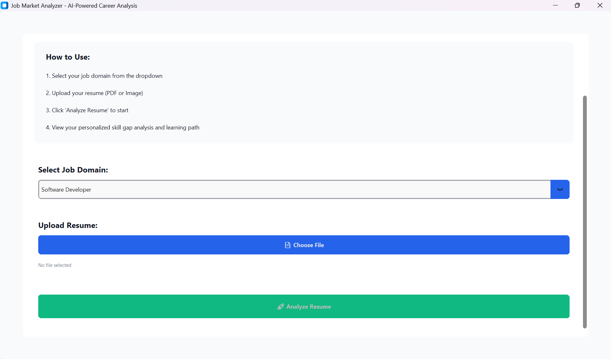
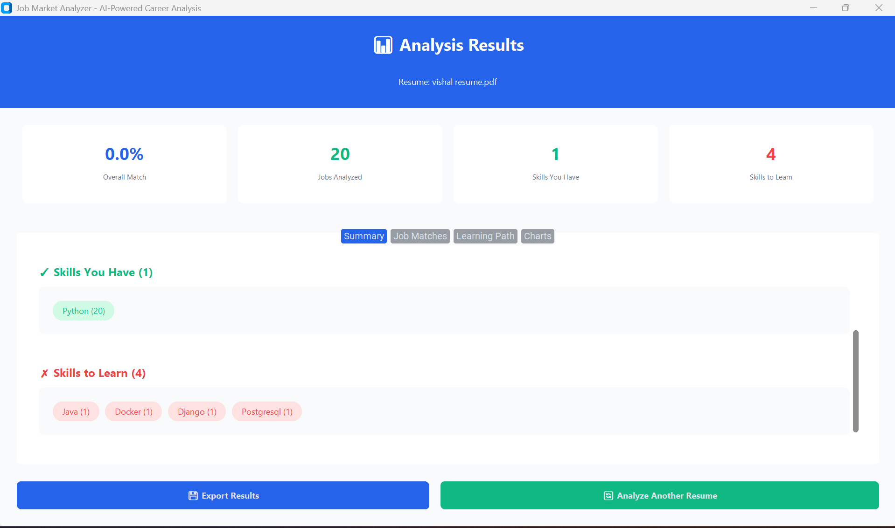
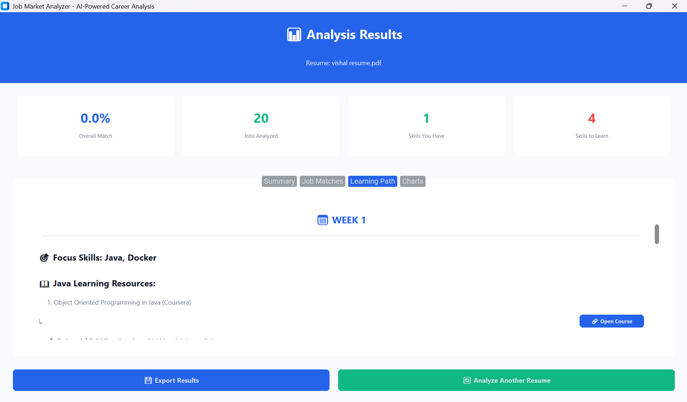

# 📊 Job Market Analyzer

> AI-Powered Career Analysis Tool for Resume Optimization & Personalized Learning Paths

[](https://www.python.org/downloads/)
[](LICENSE)
[]()

---

## 🎯 Overview

Job Market Analyzer is an intelligent career analysis tool that helps job seekers:
- 📄 **Analyze resumes** (PDF & Images)
- 🔍 **Extract skills** using NLP & AI
- 🎯 **Match with jobs** using K-Means clustering
- 📚 **Generate personalized learning paths**
- 📊 **Visualize skill gaps** with interactive charts

---

## ✨ Features

### Core Capabilities
- ✅ **Multi-format Resume Parsing** - PDF & Image (OCR) support
- ✅ **AI Skill Extraction** - NLP-based using spaCy
- ✅ **Intelligent Job Matching** - K-Means clustering algorithm
- ✅ **Personalized Learning Paths** - 4-week plans with real courses
- ✅ **Interactive Charts** - Plotly visualizations
- ✅ **Job Search Integration** - LinkedIn & Indeed links
- ✅ **Modern GUI** - CustomTkinter interface
- ✅ **Database Storage** - SQLite with 34+ courses

### Technical Highlights
- 🤖 **Machine Learning**: K-Means clustering for career path analysis
- 🧠 **Natural Language Processing**: spaCy for skill extraction
- 📸 **Computer Vision**: Tesseract OCR for image resumes
- 📊 **Data Visualization**: Interactive Plotly charts
- 💾 **Persistent Storage**: SQLite database

---

## 📷 Screenshots


<br>


<br>



---

## 🚀 Installation

### Prerequisites
- Python 3.10 or higher
- pip package manager
- Tesseract OCR (for image resumes)

### Step 1: Clone Repository
```bash
git clone https://github.com/Gowreesh31/job-market-analyzer.git
cd job-market-analyzer
```

### Step 2: Create Virtual Environment
```bash
# Windows
python -m venv venv
venv\Scripts\activate

# Mac/Linux
python3 -m venv venv
source venv/bin/activate
```

### Step 3: Install Dependencies
```bash
pip install -r requirements.txt
```

### Step 4: Download spaCy Model
```bash
python -m spacy download en_core_web_sm
```

### Step 5: Install Tesseract OCR (Optional - for image resumes)

**Windows:**
- Download: https://github.com/UB-Mannheim/tesseract/wiki
- Add to PATH or set environment variable

**Mac:**
```bash
brew install tesseract
```

**Linux:**
```bash
sudo apt-get install tesseract-ocr
```

---

## 💻 Usage

### GUI Mode (Recommended)
```bash
python main.py
```

### CLI Mode
```bash
python main.py --mode cli path/to/resume.pdf --domain "Software Developer" --jobs 20
```

---

## 📁 Project Structure
```
job-market-analyzer/
├── src/
│   ├── models/              # Data structures
│   ├── services/            # Business logic
│   ├── utils/               # Utilities
│   ├── gui/                 # GUI components
│   ├── main.py              # CLI application
│   └── gui_app.py          # GUI application
├── data/                    # SQLite database
├── charts/                  # Generated charts
├── logs/                    # Application logs
├── main.py                  # Entry point
├── requirements.txt         # Dependencies
└── README.md               # Documentation
```

---

## 🛠️ Tech Stack

| Component | Technology |
|-----------|-----------|
| **Language** | Python 3.10+ |
| **GUI Framework** | CustomTkinter |
| **Machine Learning** | scikit-learn (K-Means) |
| **NLP** | spaCy |
| **OCR** | Tesseract |
| **PDF Processing** | pdfplumber |
| **Data Visualization** | Plotly |
| **Database** | SQLite |
| **HTTP Requests** | requests |

---

## 📊 How It Works

1. **Upload Resume** - PDF or image file
2. **Text Extraction** - Parse resume using pdfplumber/Tesseract
3. **Skill Extraction** - NLP identifies technical & soft skills
4. **Job Fetching** - Retrieve sample jobs (extensible to real APIs)
5. **AI Analysis** - K-Means clustering matches resume to jobs
6. **Learning Path** - Generate personalized 4-week plan
7. **Visualization** - Interactive charts show skill gaps
8. **Export** - Save results for future reference

---

## 🎓 Use Cases

- 📝 **Job Seekers** - Identify skill gaps before applying
- 🎯 **Career Switchers** - Understand required skills for new roles
- 📚 **Students** - Plan learning paths for desired careers
- 💼 **Recruiters** - Evaluate candidate skill alignment
- 🏢 **HR Departments** - Assess training needs

---

## 🔮 Future Enhancements

- [ ] Real-time LinkedIn/Indeed API integration
- [ ] Resume builder/optimizer
- [ ] Skill assessment quizzes
- [ ] Salary estimation
- [ ] Multi-language support
- [ ] Web deployment (Streamlit/Flask)
- [ ] Mobile app version

---

## 🤝 Contributing

Contributions are welcome! Please feel free to submit a Pull Request.

1. Fork the repository
2. Create your feature branch (`git checkout -b feature/AmazingFeature`)
3. Commit your changes (`git commit -m 'Add some AmazingFeature'`)
4. Push to the branch (`git push origin feature/AmazingFeature`)
5. Open a Pull Request

---

## 📝 License

This project is licensed under the MIT License - see the [LICENSE](LICENSE) file for details.

---

## 👨‍💻 Author
**Gowreeswaran**

- 🎓 Msc Data Science at PSG College of Technology
- 🌐 GitHub: [Gowreesh31](https://github.com/Gowreesh31)
- 📧 Email: 23pd12@psgtech.ac.in
- 💼 LinkedIn: [Gowreeswaran K S](https://www.linkedin.com/in/gowreeswaran-k-s-a7b421326/)

---

## 🙏 Acknowledgments

- spaCy for NLP capabilities
- scikit-learn for ML algorithms
- CustomTkinter for modern GUI
- OpenAI for inspiration
- All open-source contributors

---

**Made with ❤️ using AI and Machine Learning**